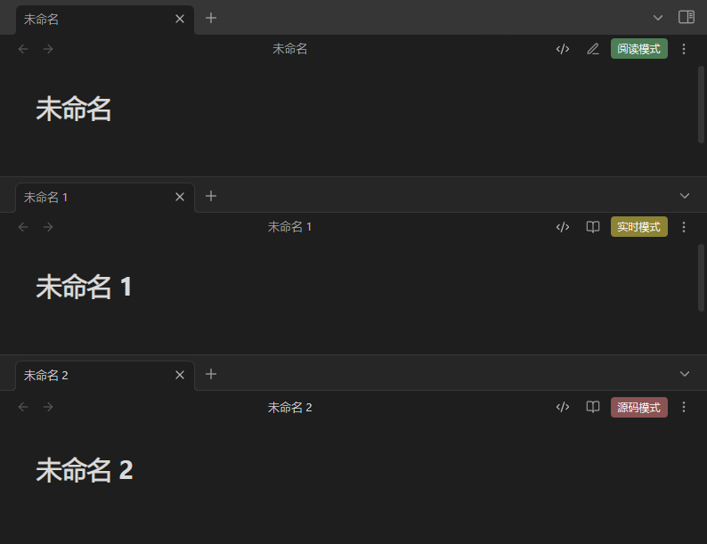

# Obsidian Show View Status

一个简单的 Obsidian 插件，用于在编辑器右上角显示当前视图的状态（阅读模式、源码模式或实时模式）。

## 功能

- 在编辑器右上角显示当前视图状态
- 支持三种状态指示：
  - 阅读模式
  - 源码模式
  - 实时预览模式

## 安装方法

1. 下载最新版本
2. 解压到你的 vault 的 `.obsidian/plugins` 目录下
3. 在设置中启用插件

## 补充说明

- 新手开发，按自己需求写的，代码比较烂，虽然目前没什么问题，但之后不好说。虽然不一定能解决，但有问题还是可以提交 issue 的，尽量尝试解决。
- 不喜欢默认颜色的话，可以自行修改插件文件夹的`styles.css` 。
